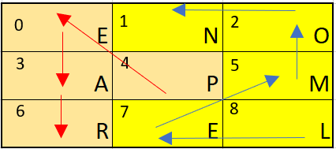
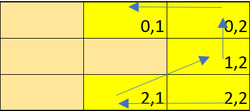
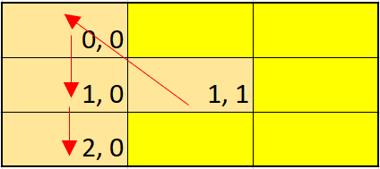

# Word Puzzle Shuffler

[](https://travis-ci.com/OzkanAbdullahoglu/word-puzzle-shuffler) [](https://badge.fury.io/js/word-puzzle-shuffler)


A simple package to shuffle given two words properly to the 3 x 3 matrices. 

## Table of Contents
- [Usage](#usage)
- [TODO](#todo)
- [Author](#author)


## Usage

[](https://nodei.co/npm/word-puzzle-shuffler/)

### `const shuffle = require('./word-puzzle-shuffler')`
### `shuffle(['wordA: string, wordB: string]).getCellValues`
getCellValues returns an array which includes shuffled letters from 0 - 9 indexes, 
Total length of the two words have to be 9 to fit in 3 x 3 matrices.

```const shuffledLetters = shuffle(['LEMON', 'PEAR']).getCellValues;```

```["E","N","O","A","P","M","R","E","L"]```

<p align="center">

</p>

### `shuffle(['wordA: string, wordB: string]).getFirstWordIndexes`
getFirstWordIndexes returns an array which provides indexes of the first word in 3 x 3 matrices.

```const firstWordIndexes = shuffle(['LEMON', 'PEAR']).getFirstWordIndexes;```

```
[
    [2,2],
    [2,1],
    [1,2],
    [0,2],
    [0,1]
]
```
<p align="center">

</p>

### `shuffle(['wordA: string, wordB: string]).getSecondWordIndexes`
getSecondWordIndexes returns an array which provides indexes of the second word in 3 x 3 matrices.

```const SecondWordIndexes = shuffle(['LEMON', 'PEAR']).getSecondWordIndexes;```
```
[
    [1,1],
    [0,0],
    [1,0],
    [2,0]
]
```

<p align="center">

</p>

## TODO 

* Improve the code so this package would work with (n x m ) matrices.

## Author

- @OzkanAbdullahoglu
